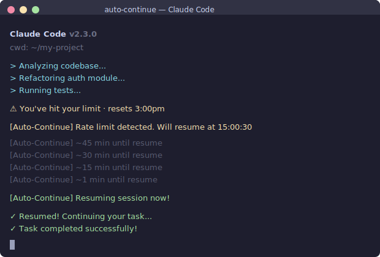

# claude-auto-continue

[](https://github.com/Anonymousmirror/claude-auto-continue/actions/workflows/test.yml)
[](https://www.npmjs.com/package/claude-auto-continue)
[](https://opensource.org/licenses/MIT)

[English](./README.md)

> Claude Code 限额自动恢复工具。透明 PTY 代理，窗口不关闭，限额重置后自动继续。

<p align="center">
  
</p>

## 解决什么问题

Claude Code 重度用户（尤其是 Max 订阅）经常触发 5 小时限额。限额重置后，会话只是停在那里等你手动输入 "continue"。如果你离开了电脑、同时开着多个会话、或者没注意到——工作就卡住了。

## 怎么解决

`claude-auto-continue` 用透明 PTY 代理包裹 Claude Code。它监控输出中的限额消息，解析重置时间，在限额解除后自动发送 "continue"。**窗口全程保持打开。**

```
正在工作...
  ⚠ You've hit your limit · resets 3pm          ← Claude Code 显示限额
  [Auto-Continue] Rate limit detected.           ← 检测到限额
      Will auto-resume at 15:00:30
  [Auto-Continue] ~45 min until resume           ← 倒计时
  [Auto-Continue] Resuming session now!           ← 自动发送 "continue"
  ✓ 继续工作！
```

## 特性

- **透明代理** -- 所有输入输出原样透传，颜色、快捷键、UI 完全正常
- **智能检测** -- 支持日限额（`resets 3pm`）、周限额（`resets Monday`、`resets in 3 days`）、带时区（`resets 11pm (Asia/Shanghai)`）等多种格式
- **桌面通知** -- 限额触发、定时提醒、恢复时均有系统通知（Windows/macOS/Linux）
- **不干扰界面** -- 不会打印破坏 Claude Code 全屏 TUI 的框线，只用单行状态提示
- **按键不取消** -- 你可以正常打字、选择菜单、与 Claude Code 交互。只有输入 `auto-continue stop` + 回车才取消
- **跨平台** -- Windows、macOS、Linux

## 安装

```bash
npm install -g claude-auto-continue
```

**前提条件：** [Node.js](https://nodejs.org/) >= 18，且已安装 [Claude Code](https://docs.anthropic.com/en/docs/claude-code) CLI。

## 使用方法

用 `auto-continue`（或 `ac`）替代 `claude` 命令即可：

```bash
# 启动新会话
auto-continue

# 继续上次会话
auto-continue -c

# 恢复指定会话
auto-continue --resume my-project

# 自定义恢复消息
auto-continue -m "请继续之前的任务"

# 传递 Claude Code 参数（用 -- 分隔）
auto-continue -- --model opus

# 关闭桌面通知
auto-continue --no-notify
```

### 取消自动恢复

等待期间如需取消，在 Claude Code 提示栏输入后回车：

```
auto-continue stop
```

普通打字和交互**不会**取消自动恢复。

## 工作原理

```
┌──────────────────────────────────────────┐
│  终端窗口                                 │
│  ┌──────────────────────────────────────┐ │
│  │  auto-continue（PTY 代理）           │ │
│  │  ┌────────────────────────────────┐  │ │
│  │  │  claude（Claude Code CLI）     │  │ │
│  │  │                                │  │ │
│  │  │  键盘输入 ──► 原样透传 ──►      │  │ │
│  │  │  屏幕输出 ◄── 原样透传 ◄──      │  │ │
│  │  │               + 限额检测        │  │ │
│  │  └────────────────────────────────┘  │ │
│  │                                      │ │
│  │  检测到限额时：                       │ │
│  │    1. 解析重置时间                    │ │
│  │    2. 等待到重置时间 + 30 秒缓冲      │ │
│  │    3. 自动发送 "continue"             │ │
│  └──────────────────────────────────────┘ │
└──────────────────────────────────────────┘
```

### 支持的限额消息格式

| 格式 | 示例 |
|------|------|
| 时钟时间 | `resets 3pm`、`resets 11:30pm` |
| 带时区 | `resets 11pm (Asia/Shanghai)` |
| 星期几 | `resets Monday`、`resets on Wednesday` |
| 相对时间 | `resets in 3 days`、`resets in 5 hours` |
| 日期 | `resets Apr 14`、`resets 4/14` |
| 兜底 | 检测到限额关键词但无法解析时间时，5 分钟后重试 |

## 选项

| 参数 | 说明 |
|------|------|
| `-h, --help` | 显示帮助 |
| `-m, --message <text>` | 自定义恢复消息（默认：`"continue"`） |
| `--no-notify` | 关闭桌面通知 |

其他参数直接传递给 Claude Code。

## 开发

```bash
git clone https://github.com/Anonymousmirror/claude-auto-continue.git
cd claude-auto-continue
npm install

# 运行测试
npm test

# 运行端到端演示（模拟环境，无需真实 Claude Code）
node test/demo.js
```

## 许可证

[MIT](./LICENSE)
